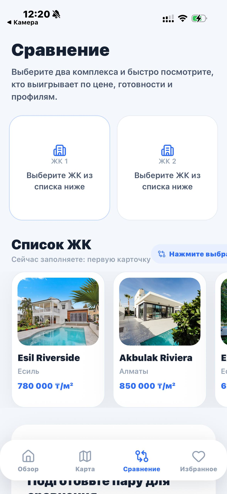
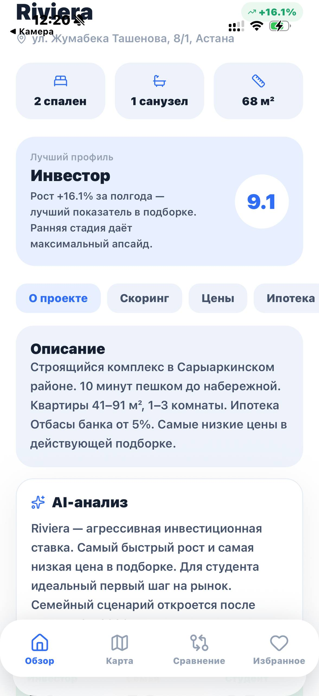

# 🏙️ AstanaZhK — Astana New Builds Analyzer

> A mobile app + scraper for analyzing the primary real estate market in Astana, Kazakhstan.  
> Live data from korter.kz, scoring for 4 buyer profiles, flip calculator, and daily price monitoring.

---

## Screenshots

<p float="left">
  
  
  
</p>

---

## Features

| Feature | Description |
|---|---|
| **korter.kz scraper** | Collects 256+ residential complexes: price/m², construction stage, developer, coordinates, photo gallery |
| **4 buyer profiles** | Investor / Family / Student / Flipper — each with its own scoring algorithm |
| **Price monitoring** | Daily price snapshots, alerts on ≥ 3% change |
| **Flip calculator** | ARV, net profit, ROI, annualized return, 70% rule — based on construction stage and renovation tier |
| **Map** | Color-coded markers by score, callout with price and stage |
| **Gallery** | 5–10 real photos per complex from korter.kz CDN |
| **Price chart** | Full price/m² history over all recorded snapshots |
| **Compare** | Side-by-side comparison of 2 complexes across all metrics |
| **Favorites** | Persistent list via AsyncStorage |

---

## Tech Stack

### 📱 Mobile (`/mobile`)
- **React Native** (Expo SDK 54) + TypeScript
- React Navigation (Stack + Bottom Tabs)
- `react-native-maps`, `expo-linear-gradient`, `lucide-react-native`
- `react-native-chart-kit` — price charts

### 🕷️ Scraper (`/scraper`)
- **Python 3.11** + `httpx` (async)
- Parses `window.INITIAL_STATE` from korter.kz SSR HTML — no Playwright needed
- **SQLite** — zero setup, portable database
- **APScheduler** — daily run at 06:00 (Almaty time)

### ⚡ API (`/scraper/api.py`)
- **FastAPI** on top of SQLite — serves the mobile app
- Full scoring algorithm implementation in Python (mirrors TypeScript logic)
- CORS, filtering by district / stage / price

### 🖥️ Frontend (`/frontend`) — web version
- React + Vite + TypeScript + PWA

---

## Architecture

```
korter.kz
    │
    ▼
scraper/parser_korter.py   ← httpx + INITIAL_STATE parsing
    │
    ▼
scraper/astana_zhk.db      ← SQLite (complexes, price_snapshots, price_alerts)
    │
    ├── scraper/api.py      ← FastAPI :8001
    │       │
    │       ▼
    │   mobile/src/api/     ← fetch + silent mock fallback
    │       │
    │       ▼
    │   Expo Go app
    │
    └── scraper/main.py     ← CLI: --now | --gallery | --stats | --alerts
```

---

## Scoring

Each complex gets a `green / yellow / red` rating per profile:

| Profile | Factors |
|---|---|
| **Investor** | Price growth (50%) + construction stage (30%) + district (20%) |
| **Family** | Completion stage (40%) + schools/parks (8%) + price (10%) |
| **Student** | Price/m² (40%) + transport (5%) + stage (25%) |
| **Flipper** | Stage (35%) + price momentum (25%) + discount to market (20%) + liquidity (20%) |

---

## Quick Start

### 1. Scraper + API

```bash
git clone https://github.com/le-sanzhar/astana-zhk.git
cd astana-zhk

pip install httpx fastapi uvicorn apscheduler loguru

# Initial scrape (256 complexes, ~5 min)
python -m scraper.main --now

# Enrich photo galleries (detail pages, ~5 min)
python -m scraper.main --gallery

# Start API
uvicorn scraper.api:app --reload --port 8001
```

### 2. Mobile App

```bash
cd mobile
npm install
npx expo start --tunnel
```

Open **Expo Go** on your phone and scan the QR code.

> The app points to `http://localhost:8001` by default.  
> If the API is unreachable it automatically falls back to mock data.

### 3. Web Frontend

```bash
cd frontend
npm install
npm run dev
# → http://localhost:5173
```

---

## Project Structure

```
AstanaZhK/
├── scraper/
│   ├── parser_korter.py   # korter.kz parser (httpx + regex + json)
│   ├── db_sqlite.py       # SQLite: schema, upsert, snapshots, alerts
│   ├── api.py             # FastAPI server
│   ├── main.py            # CLI entry point
│   └── scheduler.py       # APScheduler (daily 06:00)
├── mobile/
│   └── src/
│       ├── api/           # Types and fetch functions
│       ├── screens/       # Home, Map, Favorites, Compare, ComplexDetail
│       ├── components/    # FlipCalculator, ScoreCard, PriceChart
│       ├── utils/         # Scoring algorithms (realEstate.ts)
│       └── theme/         # Colors, typography
├── backend/               # Full FastAPI + PostgreSQL backend (extended version)
├── frontend/              # React/Vite web app
└── migrations/            # SQL migrations for PostgreSQL version
```

---

## CLI Commands

```bash
python -m scraper.main --now       # Full scrape + price update
python -m scraper.main --gallery   # Enrich photo galleries
python -m scraper.main --stats     # DB statistics
python -m scraper.main --alerts    # Alerts from last 7 days
python -m scraper.main             # Run + start daily scheduler
```

---

## API Endpoints

```
GET /health
GET /api/v1/complexes?district=Есильский&stage=foundation&min_price=400000
GET /api/v1/complexes/{korter_id}
GET /api/v1/stats
GET /api/v1/notifications
```

---

## Deploy to Vercel

The project deploys as **two separate Vercel projects** — API and Frontend.

### API (FastAPI + SQLite)

1. Push the repo to GitHub: `github.com/le-sanzhar/astana-zhk`
2. Go to [vercel.com](https://vercel.com) → **Add New Project** → import the repo
3. Settings:
   - **Root Directory:** `/` (project root)
   - **Build Command:** *(leave empty)*
   - **Output Directory:** *(leave empty)*
   - **Install Command:** `pip install -r requirements-api.txt`
4. Deploy → copy the URL, e.g. `https://astana-zhk-api.vercel.app`

### Frontend (React + Vite)

1. **Add New Project** → same repo, but change settings:
   - **Root Directory:** `frontend`
   - **Framework:** Vite
   - **Build Command:** `npm run build`
   - **Output Directory:** `dist`
2. Add environment variable:
   - `VITE_API_BASE` = `https://astana-zhk-api.vercel.app`
3. Deploy

> The SQLite database (`scraper/astana_zhk.db`) is committed to the repo and served read-only from Vercel. To update data — run `python -m scraper.main --now` locally and push the new `.db` file.

---

## Notable Technical Decisions

- **SQLite instead of PostgreSQL** for the API — zero setup, ~2 MB file, portable
- **AbortController + setTimeout** instead of `AbortSignal.timeout` — Hermes/JSC compatibility in Expo Go
- **Silent mock fallback** — app works without a server, substituting test data
- **`window.INITIAL_STATE` parsing** — all korter.kz data is embedded in SSR JSON, no headless browser needed
- **Two-stage scrape** — catalog (prices, daily) + detail pages (galleries, once) run separately

---

## License

MIT

---
---

# 🏙️ AstanaZhK — Анализатор новостроек Астаны

> Мобильное приложение и парсер для анализа рынка первичной недвижимости Астаны.  
> Реальные данные с korter.kz, скоринг по 4 профилям покупателей, флип-калькулятор и мониторинг цен.

---

## Скриншоты

<p float="left">
  
  
  
</p>

---

## Что умеет

| Функция | Описание |
|---|---|
| **Парсинг korter.kz** | Автоматический сбор 256+ ЖК: цена/м², стадия, застройщик, координаты, галерея фото |
| **4 профиля покупателя** | Инвестор / Семья / Студент / Флиппер — каждый со своим алгоритмом скоринга |
| **Мониторинг цен** | Ежедневные снимки цен, алерты при изменении ≥ 3% |
| **Флип-калькулятор** | ARV, чистая прибыль, ROI, годовых, правило 70% — по стадии стройки и типу ремонта |
| **Карта** | Цветные маркеры по скорингу, callout с ценой и стадией |
| **Галерея** | 5–10 реальных фото каждого ЖК с CDN korter.kz |
| **График цен** | История цены/м² за всё время наблюдений |
| **Сравнение** | Side-by-side сравнение до 2 ЖК по всем метрикам |
| **Избранное** | Персистентный список с AsyncStorage |

---

## Стек

### 📱 Mobile (`/mobile`)
- **React Native** (Expo SDK 54) + TypeScript
- React Navigation (Stack + Bottom Tabs)
- `react-native-maps`, `expo-linear-gradient`, `lucide-react-native`
- `react-native-chart-kit` — графики цен

### 🕷️ Scraper (`/scraper`)
- **Python 3.11** + `httpx` (async)
- Парсинг `window.INITIAL_STATE` из SSR-HTML korter.kz — без Playwright
- **SQLite** — нулевая настройка, портативная база
- **APScheduler** — ежедневный запуск в 06:00 (Алматы)

### ⚡ API (`/scraper/api.py`)
- **FastAPI** поверх SQLite — отдаёт данные мобильному приложению
- Полная реализация скоринговых алгоритмов на Python (зеркало TS-логики)
- CORS, фильтрация по району / стадии / цене

### 🖥️ Frontend (`/frontend`) — веб-версия
- React + Vite + TypeScript + PWA

---

## Архитектура

```
korter.kz
    │
    ▼
scraper/parser_korter.py   ← httpx + INITIAL_STATE parsing
    │
    ▼
scraper/astana_zhk.db      ← SQLite (complexes, price_snapshots, price_alerts)
    │
    ├── scraper/api.py      ← FastAPI :8001
    │       │
    │       ▼
    │   mobile/src/api/     ← fetch + mock fallback
    │       │
    │       ▼
    │   Expo Go app
    │
    └── scraper/main.py     ← CLI: --now | --gallery | --stats | --alerts
```

---

## Скоринг

Каждый ЖК получает оценку `green / yellow / red` по профилю:

| Профиль | Факторы |
|---|---|
| **Инвестор** | Рост цены (50%) + стадия стройки (30%) + район (20%) |
| **Семья** | Стадия готовности (40%) + школы/парки (8%) + цена (10%) |
| **Студент** | Цена/м² (40%) + транспорт (5%) + стадия (25%) |
| **Флиппер** | Стадия (35%) + динамика цены (25%) + дисконт к рынку (20%) + ликвидность (20%) |

---

## Быстрый старт

### 1. Парсер + API

```bash
git clone https://github.com/le-sanzhar/astana-zhk.git
cd astana-zhk

pip install httpx fastapi uvicorn apscheduler loguru

# Первичный скрейп (256 ЖК, ~5 мин)
python -m scraper.main --now

# Обогащение галерей (~5 мин)
python -m scraper.main --gallery

# Запуск API
uvicorn scraper.api:app --reload --port 8001
```

### 2. Мобильное приложение

```bash
cd mobile
npm install
npx expo start --tunnel
```

Откройте **Expo Go** на телефоне и отсканируйте QR.

> По умолчанию приложение обращается к `http://localhost:8001`.  
> При недоступности API автоматически используются mock-данные.

### 3. Веб-фронтенд

```bash
cd frontend
npm install
npm run dev
# → http://localhost:5173
```

---

## Структура проекта

```
AstanaZhK/
├── scraper/
│   ├── parser_korter.py   # Парсер korter.kz
│   ├── db_sqlite.py       # SQLite: схема, upsert, снимки цен, алерты
│   ├── api.py             # FastAPI сервер
│   ├── main.py            # CLI точка входа
│   └── scheduler.py       # APScheduler
├── mobile/
│   └── src/
│       ├── api/           # Типы и fetch-функции
│       ├── screens/       # Home, Map, Favorites, Compare, ComplexDetail
│       ├── components/    # FlipCalculator, ScoreCard, PriceChart
│       ├── utils/         # Скоринговые алгоритмы (realEstate.ts)
│       └── theme/         # Цвета, типографика
├── backend/               # Полный FastAPI + PostgreSQL бэкенд
├── frontend/              # React/Vite веб-приложение
└── migrations/            # SQL миграции
```

---

## CLI команды

```bash
python -m scraper.main --now       # Полный скрейп + обновление цен
python -m scraper.main --gallery   # Обогащение фотогалерей
python -m scraper.main --stats     # Статистика БД
python -m scraper.main --alerts    # Алерты за последние 7 дней
python -m scraper.main             # Запуск + планировщик
```

---

## Деплой на Vercel

Проект деплоится как **два отдельных Vercel-проекта** — API и Frontend.

### API (FastAPI + SQLite)

1. Запушить репо на GitHub: `github.com/le-sanzhar/astana-zhk`
2. [vercel.com](https://vercel.com) → **Add New Project** → импортировать репо
3. Настройки:
   - **Root Directory:** `/`
   - **Install Command:** `pip install -r requirements-api.txt`
   - Build Command и Output Directory — оставить пустыми
4. Deploy → скопировать URL, например `https://astana-zhk-api.vercel.app`

### Frontend (React + Vite)

1. **Add New Project** → то же репо, но:
   - **Root Directory:** `frontend`
   - **Framework:** Vite
   - **Build Command:** `npm run build`
   - **Output Directory:** `dist`
2. Добавить переменную окружения:
   - `VITE_API_BASE` = `https://astana-zhk-api.vercel.app`
3. Deploy

> БД (`scraper/astana_zhk.db`) коммитится в репо и раздаётся read-only с Vercel.  
> Чтобы обновить данные — запусти `python -m scraper.main --now` локально и запуши новый `.db`.

---

## Технические решения

- **SQLite вместо PostgreSQL** — нулевая настройка, файл ~2 МБ
- **AbortController + setTimeout** — совместимость с Hermes/JSC в Expo Go
- **Mock fallback** — приложение работает без сервера
- **`window.INITIAL_STATE`** — весь JSON korter.kz в SSR, Playwright не нужен
- **Двухэтапный скрейп** — каталог (цены, ежедневно) + детали (галереи, однократно)

---

## Лицензия

MIT
